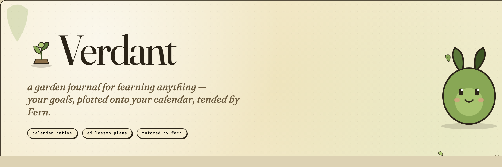
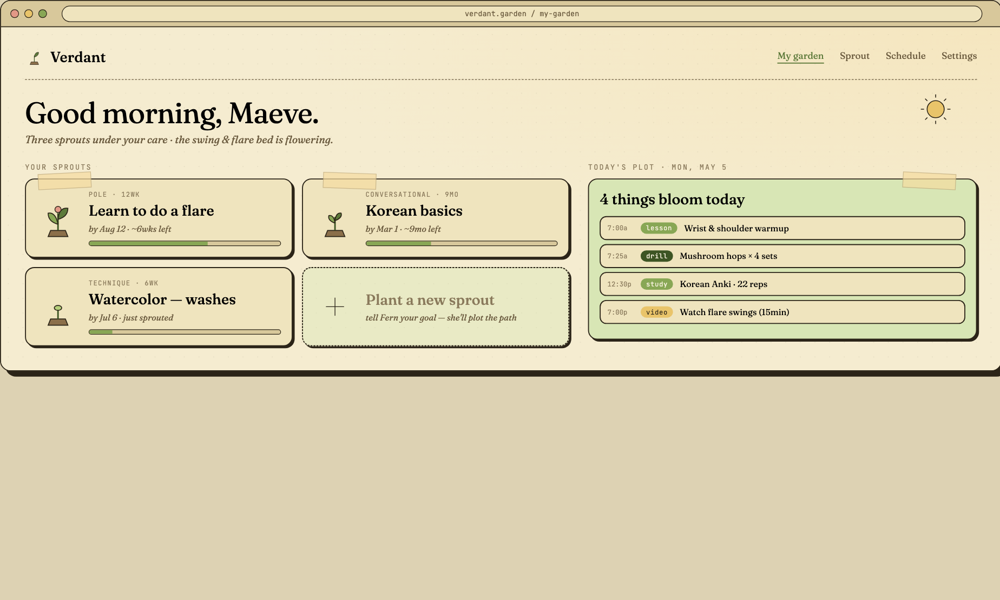
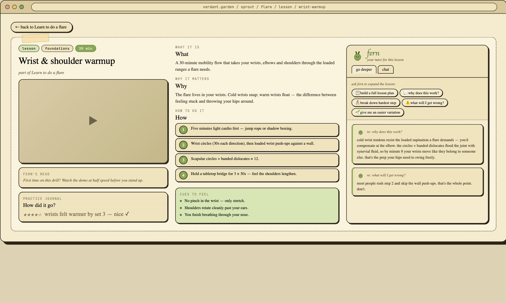
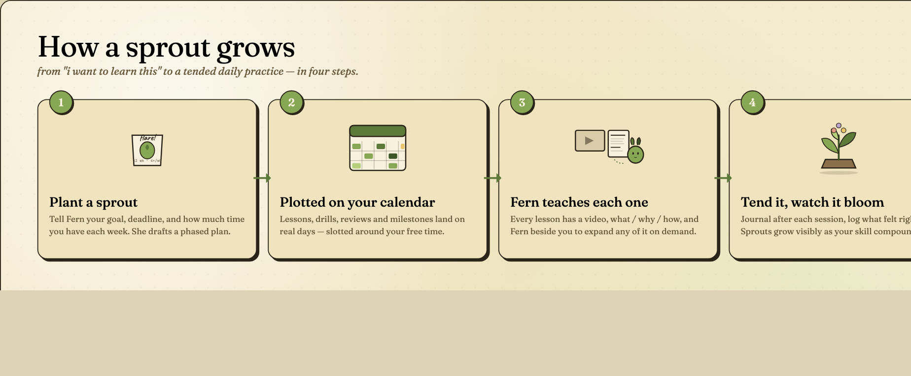

<p align="center">
  
</p>

<p align="center">
  <em>A garden journal for learning anything.</em><br/>
  Tell Verdant what you want to learn and when you need it. Fern (the resident sprite-tutor) drafts a phased plan, plots it onto your real calendar, and teaches you each lesson on the day it sprouts.
</p>

<p align="center">
  <a href="#-the-garden">The garden</a> ·
  <a href="#-the-lesson">The lesson</a> ·
  <a href="#-how-a-sprout-grows">How a sprout grows</a> ·
  <a href="#-running-it-locally">Run it locally</a>
</p>

---

## 🌱 The garden

Your **garden** is the home view: every learning goal you're tending lives here as a *sprout*, alongside today's plot — the lessons, drills, and reviews that bloom today.

<p align="center">
  
</p>

A **sprout** is one learning goal with a deadline (e.g. *learn to do a flare by Aug 12*, *Korean basics by next March*). For each sprout Verdant tracks:

- The **phased plan** the LLM drafted — foundations → practice → review → milestones.
- A **progress bar** that fills as you complete sessions and journal them.
- The **next thing to do**, surfaced at the right time on the right day.

Today's plot is your daily glance: each session is tagged (`lesson`, `drill`, `study`, `video`), timed, and ordered for the day Fern thought made the most sense given your free time and energy patterns.

---

## 📖 The lesson

Click into any session and you land on a **lesson page**. Every lesson has the same anatomy — and Fern is sitting right next to it.

<p align="center">
  
</p>

Three columns, designed to short-circuit the *"…ok but why am I doing this?"* spiral:

| Column | What lives there |
|---|---|
| **Material** | A demo video, Fern's *one-line read* on the lesson, and a **practice journal** for an effectiveness rating + a free-text note after the session. |
| **What / Why / How** | The lesson itself — *what* this drill is, *why* it's in your plan today, *how* to actually do it (numbered steps), and *cues to feel* so you know when you've got it. |
| **Fern, your tutor** | A chat panel pinned to the lesson. One-tap prompts — *"why does this work?"*, *"break down the hardest step"*, *"what will I get wrong?"*, *"give me an easier variation"* — and the answers stack up as **deepen cards** so you can re-skim them later. |

Fern is context-aware: she knows the sprout, the phase, and the lesson she's teaching, so her answers come back grounded in *your* plan, not a generic web search.

---

## 🌿 How a sprout grows

<p align="center">
  
</p>

1. **Plant a sprout.** You give Fern a goal, a deadline, and how much time you have each week. She writes a `SproutPlan` — phases of lessons, drills, reviews, and milestones — using GPT-4o-mini. *(No API key? A built-in template fills in.)*
2. **Plotted on your calendar.** Verdant greedily packs sessions into your weekly availability windows, clamps them to 15–120 min, and respects a daily workload cap. If you've connected Google Calendar, every session becomes a real event.
3. **Fern teaches each one.** When a session comes due, the lesson page is ready: video, what/why/how, cues, and Fern beside you to expand any of it.
4. **Tend it daily, watch it bloom.** Mark complete, rate the slot 1–5, drop a journal note. Verdant accumulates per-weekday-and-time effectiveness so future plans favour the slots that actually work for you. Miss a day? Hit **Reschedule from today**, or just type *"make this week lighter"* / *"move tomorrow to Thursday night"* and Fern patches the plan.

---

## ✨ Features at a glance

- **🪴 LLM-generated plans** — A `SproutPlan` of phases and tasks from your goal, deadline, and starter resources.
- **📅 Constraint-aware scheduling** — Sessions are slotted into your real availability with a per-day workload cap.
- **🔄 Google Calendar sync** — Optional two-way: every scheduled session becomes a calendar event.
- **🌦️ Adaptive rescheduling** — Mark complete, rate, miss, or reschedule; the rest of the plan redistributes.
- **💬 Natural-language edits** — Patch the plan with short phrases instead of drag-and-drop.
- **🌡️ Slot-effectiveness learning** — Per-weekday-and-time ratings inform future planning.
- **🦔 Fern, in every lesson** — A context-aware tutor pinned to each lesson page, with one-tap *go deeper* prompts.

---

## 🛠 Tech stack

Next.js 15 (App Router) · React 19 · TypeScript · Tailwind · Prisma + SQLite · NextAuth v5 (Google) · OpenAI SDK · Google Calendar API · Zod.

---

## 🚿 Running it locally

### Prerequisites

- Node 18+ and npm
- A Google Cloud OAuth client (Web application) with `http://localhost:3000/api/auth/callback/google` as an authorized redirect URI. Enable the Google Calendar API on the same project for calendar sync.
- *Optional:* an OpenAI API key. Without it, plan generation falls back to a template.

### Setup

```bash
git clone <your-fork-url> verdant
cd verdant
npm install            # runs `prisma generate` via postinstall
cp .env.example .env   # then fill in the values below
npm run db:push        # create the SQLite schema at ./dev.db
npm run dev            # start the Next.js dev server on :3000
```

Fill in `.env`:

```env
DATABASE_URL="file:./dev.db"
AUTH_SECRET="$(openssl rand -base64 32)"
AUTH_URL="http://localhost:3000"
AUTH_GOOGLE_ID="<google-oauth-client-id>"
AUTH_GOOGLE_SECRET="<google-oauth-client-secret>"
OPENAI_API_KEY=""   # optional
```

Then open [http://localhost:3000](http://localhost:3000), sign in with Google, set your weekly availability in **Settings**, and plant your first sprout.

### Example availability

```json
{
  "Mon": [{ "start": "19:00", "end": "21:00" }],
  "Tue": [{ "start": "19:00", "end": "21:00" }],
  "Wed": [{ "start": "19:00", "end": "21:00" }],
  "Thu": [{ "start": "19:00", "end": "21:00" }],
  "Fri": [{ "start": "19:00", "end": "21:00" }],
  "Sat": [{ "start": "10:00", "end": "12:00" }],
  "Sun": [{ "start": "10:00", "end": "12:00" }]
}
```

Max minutes/day: `90`. Toggle **Connect Google Calendar** in Settings to sync.

### Scripts

| Command | What it does |
| --- | --- |
| `npm run dev` | Next.js dev server with hot reload |
| `npm run build` | `prisma generate && next build` |
| `npm start` | Run the production build |
| `npm run db:push` | Apply the Prisma schema to the SQLite database |
| `npm run lint` | ESLint |

---

## 🗂 Project layout

```
src/
  app/
    page.tsx              # landing
    login/                # Google sign-in
    dashboard/            # the garden — active sprouts + today's plot
    plan/new/             # plant a new sprout
    plan/[id]/            # sprout detail + lesson pages
    settings/             # time windows, daily cap, calendar toggle
    api/
      plans/              # POST create, GET active, PATCH update/reschedule
      preferences/        # GET/PATCH time windows + slot effectiveness
      auth/[...nextauth]/ # NextAuth handler
prisma/
  schema.prisma           # User, LearningPlan, TaskCompletion, UserPreference
docs/
  readme/                 # source HTML for the README artwork
  verdant.css             # shared design tokens used by the mockups
```

---

## 📝 Notes

- **No OpenAI key?** `generateSproutPlan()` returns a template sprout with foundation / practice / review / milestone tasks — the rest of the app works unchanged.
- **Calendar sync** requires the Google account to have granted the Calendar scope at sign-in; toggle **Connect Google Calendar** in Settings.
- Data lives in a local SQLite file by default (`dev.db`). Swap `DATABASE_URL` to Postgres for production and re-run `prisma db push` / migrate.
- The README artwork lives as plain HTML/CSS in [`docs/readme/`](docs/readme/) — open the `_*.html` files in a browser to tweak, then re-render.

<p align="center"><em>~ tend it daily ~</em></p>
